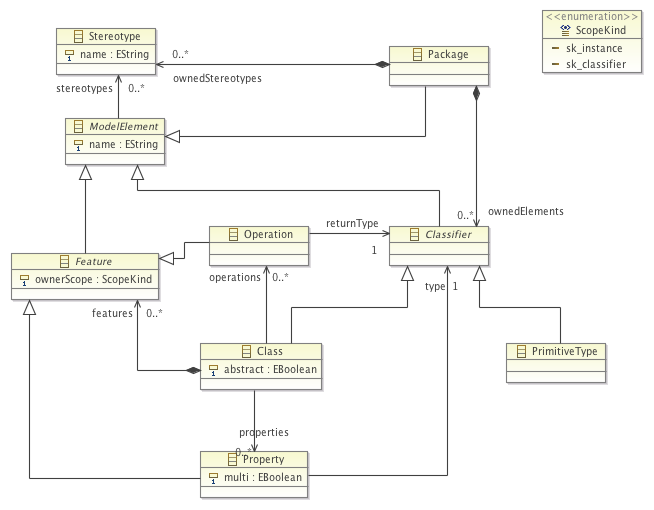

This pages contains additional material accompanying the paper _"Exploring Internal Domain-Specific Languages for Model Manipulation"_ for [SLE'13](http://planet-sl.org/sle2013/) conference. All Sigma related code is in the SLE13 branch.

## Models

### Object-Oriented Model (OO Model)

### Relational Model (DB Model)

## M2T Micro-benchmarking

The example on which we run a sample micro benchmarks was inspired by the example from [Acceleo tutorial](http://wiki.eclipse.org/Acceleo/Getting_Started#Generating_java_beans).

### Sigma Code

`OO2Java.scala`:

    import fr.unice.i3s.sigma.m2t.M2T
    import oo.support.OOPackageScalaSupport

    class OO2Java extends M2T with OOPackageScalaSupport { 
      type Root = Class // input type for this transformation
      
      // main template
      def render =
        !s"public class ${root.name}" curlyIndent {
          !endl // extra new line
       
          for (o <- root.operations) {
            genOperation(o) // call to another template
            !endl // extra new line
          }
        }
        
      def genOperation(o: Operation) =
        !s"public ${o.returnType.name} ${o.name}()" curlyIndent {
          !s"""
          // TODO: should be implemented
          throw new UnsupportedOperationException("${o.name}");
          """
        } 
    }

### EGL Code

The EGL code was split to simulate similar modularity of the other M2T transformations.

`OO2Java.egl`:

    [%
      TemplateFactory.setOutputRoot(targetDir);
      
      for (cls in Class.allInstances()) {
        var t : Template = TemplateFactory.load("JavaClass.egl");
        t.populate("cls",cls);
        t.generate(cls.filename());    
      }
        
      operation Class filename() : String {
        return self.name + ".java";
      }
     %]

`JavaClass.egl`:

    public class [%=cls.name %] {
    [% for (o in cls.operations) { %]
        public [%=o.returnType.name %] [%=o.name %]() {
          // TODO: should be implemented
          throw new UnsupportedOperationException("[%=o.name %]");      
        }
    [% } %]
    }

### Acceleo Code

`OO2Java.mtl`:

    [comment encoding = UTF-8 /]
    [module generate('http://oo/1.0')]

    [template public genOperation(o : Operation)]
    public [o.returnType.name/] [o.name/]() {
      // TODO: should be implemented
      throw new UnsupportedOperationException("[o.name/]");
    }
    [/template]

    [template public generateClass(cls : Class)]
    [comment @main/]
    [file (cls.name.concat('.java'), false)]
    public class [cls.name/] {
    [for (o: Operation | cls.operations) separator('\n')]
      [genOperation(o) /]
    [/for]
    }
    [/file]
    [/template]

### Pure Scala Code

The idea behind a _pure_ Scala implementation (no implicit conversions) is to get an impression about the performance degradation of using Sigma in comparison to only Scala. 

`OO2JavaInPureScala.scala`:

    package fr.unice.i3s.sigma.examples.sle13.sigma

    import oo.Class
    import oo.Operation

    class OO2JavaInPureScala(cls: Class) {

      val sb = new StringBuilder

      def genOperation(o: Operation) {
        sb.append("\tpublic ").append(o.getReturnType().getName()).append(" " + o.getName() + " {")
        sb.append("\t\t// TODO: should be implemented")
        sb.append("\t\tthrow new UnsupportedOperationException(\"").append(o.getName()).append("\");")
        sb.append("}")
      }

      def generate = {
        sb.append("public class " + cls.getName() + " {");
        var i = 0
        while (i < cls.getOperations().size()) {
          genOperation(cls.getOperations().get(i))
          i += 1
        }
        sb.append("}")
        
        sb.toString
      }
    }

### Java Code

`OO2Java.java`:

    package fr.unice.i3s.sigma.examples.sle13.java;

    import oo.Class;
    import oo.Operation;

    public class Uml2JavaInJava {

        private final Class cls;
        private final StringBuilder sb = new StringBuilder();

        public Uml2JavaInJava(Class cls) {
            this.cls = cls;
        }
        
        public void genOperation(Operation o) {
            sb.append("\tpublic ").append(o.getReturnType().getName()).append(" "+o.getName()+" {");
            sb.append("\t\t// TODO: should be implemented");
            sb.append("\t\tthrow new UnsupportedOperationException(\"").append(o.getName()).append("\");");
            sb.append("}");
        }
        
        public String generate() {              
            sb.append("public class "+cls.getName()+" {");
            for (Operation o: cls.getOperations()) {
                genOperation(o);
            }
            sb.append("}");
            
            return sb.toString();       
        } 
    }

### Sample results

Following are the running times in milliseconds for 20 runs each transforming 500 classes with 50 methods. Like other micro-benchmarking, these results are only informative.

<iframe width="100%" height="630" frameborder="0" src="https://docs.google.com/spreadsheet/pub?key=0AgXBNlEmVc-kdDFRWlFtRXg4OHFBSlUzNXM2ZmhqWUE&single=true&gid=0&output=html&widget=true" />
